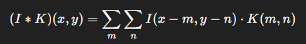

Red Neuronal Convolucional (CNN) que detecta números escritos a mano.

Anteriormente habia creado una red MLP que realizaba la misma tarea.

Ahora hare el paso de MLP a CNN con el proposito de mejorar la presición

Arquitectura típica de una CNN

Entrada (imagen)  
       ↓ 
Convolución + ReLU 
       ↓ 
Pooling 
       ↓ 
Convolución + ReLU 
       ↓ 
Pooling 
       ↓ 
Flatten 
       ↓ 
Fully Connected 
       ↓ 
Softmax (clasificación) 
 
<h3>Si bien en MLP iniciabamos pesos al azar y los ajustabamos con retropropagación. Aqui lo que se iniciará y ajustaran seran los Kernels de las convoluciones*.</h3>

Si bien la formula puede parecer compleja. Las convoluciones pueden explicarse de una manera simple. Al menos para lo que ocupa el tema en cuestion.

Tenemos una imagen que sera traducida en un mapa con valores entre 0 y 1:
    x_train = train.drop(columns=['label']).values / 255.0
    x_train = x_train.reshape(-1, 28, 28, 1)
Se observa que igual que en MLP tomo los datos del csv, quito la columna label y divido por el valor maximo (255) para normalizar los datos en una escala entre 0 y 1 que representaran la escala de grises de la imagen.
Luego con reshape transformo ese arreglo de valores en matrices de 28x28. Sobre ese mapa es que se realizara la convolución.

Ahora bien. A modo de ejemplo mostrare el proceso de una convolución, en nua matris no de 28x28, sino de 3x3 con un kernel de 2x2

I = imagen de entrada (matriz) 
K = kernel/filtro (matriz pequeña, ejemplo 3x3) 
Y = feature map 

Interpretación:

-Deslizas el kernel sobre la imagen 
-Multiplicas cada elemento del kernel por el pixel correspondiente 
-Sumas todo → un número en el feature map 

I = [[1, 2, 0], 
     [0, 1, 3], 
     [1, 2, 2]] 

K = [[1, 0], 
     [0, -1]] 

Primer paso (arriba izquierda): 
1x1 + 2x0 + 0x0 + 1x(-1) = 1 + 0 + 0 - 1 = 0 
Segundo paso (arriba derecha): 
2x1 + 0x0 + 1x0 + 3x(-1) = 2 + 0 + 0 - 3 = -1 
Tercer paso (abajo izquierda): 
0x1 + 1x0 + 1x0 + 2x(-1) = 0 + 0 + 0 - 2 = -2 
Cuarto paso (abajo derecha): 
1x1 + 3x0 + 2x0 + 2x(-1) = 1 + 0 + 0 - 2 = -1 

Y = [[0, -1], 
     [-2, -1]] 

En nuestro algoritmo K sera iniciado con valores aleatorios, y por medio de retro-propagación se ajustara para obtener los resultados deseados con el entrenamiento de la red.

En nuestra estructura de capas model = sequencial([]) observamos:

    Conv2D(32, (3, 3), activation='relu', input_shape=(28, 28, 1)),

La librería TensorFlow se encargara de hacer las convoluciones aplicando 32 Kernels de tamaño 3x3 sobre el input de 28x28 que es nuestra imagen.

Haciendo las cuentas, de una matriz de 28x28 a la que se convoluciones con kernerls de 3x3, se obtienen salidas de 26x26.

A estas salidas se aplica la funcion MaxPooling2D

    MaxPooling2D((2,2))

Esta funcion recorre la salida anterior de 26x26 en un cuadrante de 2x2, y por cada cuadrante tomara el valor maximo allado para construir una nueva matris de salida con esos valores.

Para una matriz de 26x26 MaxPooling2D((2,2)) dara una salida de 13x13

Un ejemplo con una matriz mas pequeña

[[1, 3, 2, 4], 
 [5, 6, 1, 2], 
 [0, 2, 3, 1], 
 [1, 0, 2, 4]] 

Pooling de 2x2:

[[6, 4], 
 [2, 4]] 

De los 32 mapas resultantes del MaxPooling se vuelve a concolucionar con 63 kernels 3x3. y se vuelve a realizar un MaxPooling 2x2. El esultado son 63 mapas de 11x11

    Conv2D(63, (3, 3), activation='relu'),
    MaxPooling2D((2, 2)),

*https://es.wikipedia.org/wiki/Convoluci%C3%B3n