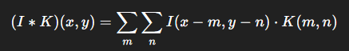

# Rede Neural Convolucional (CNN) que detecta números escritos à mão

Anteriormente eu havia criado uma rede MLP que realizava a mesma tarefa.

Agora farei a transição de MLP para CNN com o objetivo de melhorar a precisão.

## Arquitetura típica de uma CNN

Entrada (imagem)  
↓  
Convolução + ReLU  
↓  
Pooling  
↓  
Convolução + ReLU  
↓  
Pooling  
↓  
Flatten  
↓  
Fully Connected  
↓  
Softmax (classificação)

### Assim como na MLP iniciávamos pesos aleatórios e os ajustávamos com retropropagação, aqui o que será iniciado e ajustado são os *kernels* das convoluções\*.

Embora a fórmula possa parecer complexa, as convoluções podem ser explicadas de forma simples para o propósito deste exemplo.

Temos uma imagem que será convertida em uma matriz com valores entre 0 e 1:
  
    x_train = train.drop(columns=['label']).values / 255.0
    x_train = x_train.reshape(-1, 28, 28, 1)

Como na MLP, removo a coluna *label* e normalizo os dados dividindo por 255. Em seguida, uso `reshape` para transformar esse vetor em matrizes 28x28. Sobre esse mapa será feita a convolução.

A seguir, um exemplo simples de convolução, usando uma matriz 3x3 com um kernel 2x2:

I = imagem de entrada (matriz)  
K = kernel/filtro (matriz pequena, ex: 3x3)  
Y = feature map

**Interpretação:**  
— Deslize o kernel sobre a imagem  
— Multiplique cada elemento do kernel pelo pixel correspondente  
— Some tudo → isso gera um número no *feature map*

I = [[1, 2, 0],  
     [0, 1, 3],  
     [1, 2, 2]]

K = [[1, 0],  
     [0, -1]]

Primeiro passo (superior esquerdo):  
1×1 + 2×0 + 0×0 + 1×(-1) = 0  
Segundo passo (superior direito):  
2×1 + 0×0 + 1×0 + 3×(-1) = -1  
Terceiro passo (inferior esquerdo):  
0×1 + 1×0 + 1×0 + 2×(-1) = -2  
Quarto passo (inferior direito):  
1×1 + 3×0 + 2×0 + 2×(-1) = -1

Y = [[0, -1],  
     [-2, -1]]

Nosso algoritmo inicia K com valores aleatórios, ajustando-os via retropropagação durante o treinamento.

No modelo usamos:

    Conv2D(32, (3, 3), activation='relu', input_shape=(28, 28, 1)),

O TensorFlow aplica 32 kernels 3x3 sobre a imagem 28x28, produzindo saídas 26x26.

Em seguida aplicamos MaxPooling:

    MaxPooling2D((2,2))

Com pooling 2x2 sobre uma matriz 26x26, obtemos uma saída 13x13.

Exemplo:

    [[1, 3, 2, 4],  
     [5, 6, 1, 2],  
     [0, 2, 3, 1],  
     [1, 0, 2, 4]]

Pooling 2x2:

    [[6, 4],  
     [2, 4]]

Dos 32 mapas resultantes, convolucionamos novamente com 63 kernels 3x3 e aplicamos outro MaxPooling 2x2. O resultado são 63 mapas 5x5.

    Conv2D(63, (3, 3), activation='relu'),
    MaxPooling2D((2, 2)),

Podemos pensar nisso como uma única matriz tridimensional de dimensão 63×5×5 = 1575 valores.

`Flatten()` transforma esses 1575 valores em um vetor unidimensional, e `Dense(128, activation='relu')` os conecta a 128 neurônios.

Outra diferença importante entre MLP e CNN é que a CNN tenta interpretar formas visuais — linhas, curvas, círculos — e não apenas estatísticas.

Para evitar sobreajuste, usamos Dropout:

    Dropout(0.5)

Ele desativa aleatoriamente metade dos 128 neurônios durante o treinamento, evitando dependência excessiva de certos padrões visuais.

O modelo obteve **99,19% de acurácia**.

Total params: 221,545 (865.41 KB)  
Trainable params: 221,545 (865.41 KB)  
Non-trainable params: 0

Resultados por época:

Epoch 1/10  
accuracy: 0.9187 — val_accuracy: 0.9785  
Epoch 2/10  
accuracy: 0.9728 — val_accuracy: 0.9854  
Epoch 3/10  
accuracy: 0.9803 — val_accuracy: 0.9864  
Epoch 4/10  
accuracy: 0.9827 — val_accuracy: 0.9892  
Epoch 5/10  
accuracy: 0.9860 — val_accuracy: 0.9886  
Epoch 6/10  
accuracy: 0.9881 — val_accuracy: 0.9907  
Epoch 7/10  
accuracy: 0.9883 — val_accuracy: 0.9899  
Epoch 8/10  
accuracy: 0.9897 — val_accuracy: 0.9868  
Epoch 9/10  
accuracy: 0.9914 — val_accuracy: 0.9908  
Epoch 10/10  
accuracy: 0.9920 — val_accuracy: 0.9919  

\* https://pt.wikipedia.org/wiki/Convolu%C3%A7%C3%A3o  
\*\* Ver README.md da rede MLP (https://github.com/Nahuel77/Red_Neuronal_MLP)
